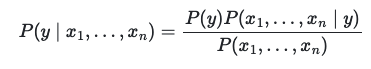
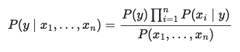
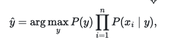
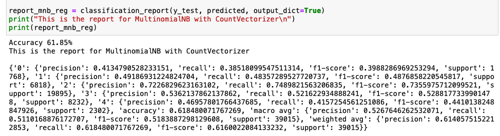
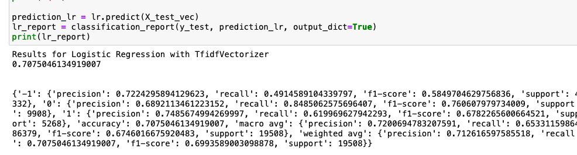
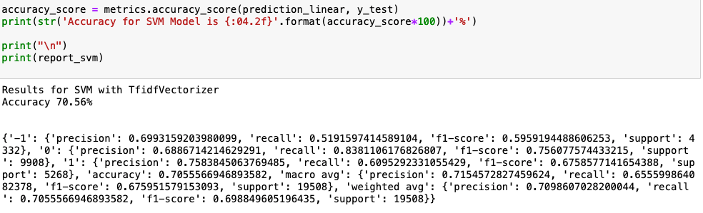

# Project Deliverables 
- [Demo Video](https://vimeo.com/655115555/0587378ff3)
- [Final Documentation](https://github.com/winston86zhu/UserSentimentAnalysis/blob/main/Project%20Documentation.pdf)
- [Final Presentation Slides](https://github.com/winston86zhu/UserSentimentAnalysis/blob/main/cs410Final%20Presentation.pptx)

# CourseProject

Please fork this repository and paste the github link of your fork on Microsoft CMT. Detailed instructions are on Coursera under Week 1: Course Project Overview/Week 9 Activities.

- [CourseProject](#courseproject)
- [Overview](#overview)
  * [Part1: Application](#part1--application)
  * [Part 2: Model Comparison](#part-2--model-comparison)
- [Documentation of Software](#documentation-of-software)
  * [Data Cleaning](#data-cleaning)
  * [Data Preparation](#data-preparation)
  * [Bayes](#bayes)
  * [SVM](#svm)
  * [Vadar Model](#vadar-model)
  * [Flask Framework](#flask-framework)
  * [Model Comparison](#model-comparison)
- [Documentation of the usage of the software](#documentation-of-the-usage-of-the-software)
  * [Start the App](#start-the-app)
- [Contribution](#contribution)
- [Launch the App](#launch-the-app)

# Overview

This section provides an overview of the application.

There are 2 components/purposes of this project. One is to build a fullstack sentimental analysis 
application that can help user automatically identify the sentimental of a text or paragraph. The second 
part is to implement and compare performance of different text analysis models and let user try different ones.

## Part1: Application
The main objective of the application is to classify the twitter text dataset regarding a realistic label. The label is multi-level and the input is pure text input, similar to what we worked on in MP2.2 or MP2.3. 
For example, given the Twitter text, we will identify the sentiment associated as being positive or negative. 
The majority of the knowledge will come from the lectures in Week 12, where a serial of discriminative models were introduced.
Yet in class, we did not compare performance among the models, which directs me to this initiative.

Another challenge is to build a locally hosted full-stack project. I have been a backend/cloud engineer throughout my career,
so this is also a beneficial challenge to pick-up a small full stack project. 

## Part 2: Model Comparison

The part is done in the .ipynb files under `/model/`. The motivation is that we 
are missing model comparisons in the Week 12 lecture. By implementing multiple 
discriminative NLP models introduced in lecture, users/students can easily understand 
the below factors in different models. Therefore, this can become a supplementary
resource to the lecture slides.

```angular2html
- Precision
- Recall
- F1 Score
- Aggregated Accuracy 
```

# Documentation of Software

## Data Cleaning

1. convert all the characters to lower letters
2. Use `PorterStemmer()` to create a column where every word has been stemmed 
3. Use different tokenizers (e.g `RegexpTokenizer`) and picked the one with the 
that can achieve the highest accuracy to tokenize the words

## Data Preparation 
1. extract the data and labels from the dataframe
2. Split the data vector into training and testing data, using `train_test_split`
3. Transfer the input string to vector using `CountVectorizer`

## Bayes 
From the lecture resources, I started with Bayes model, because Naive Bayes is the simplest 
and fastest classification algorithm for a large chunk of data. According to class
The most likely class is defined as the one having the highest probability. The 
**Maximum A Posteriori (MAP)** is another name for this (MAP).

Bayes’ theorem states the following relationship, given class variable y and dependent feature vector x_1...x_n


Then after applying the independence of all the **n** variables, we have the following relationship


From here we have the Maximum A Posteriori (MAP) to estimate P(y) and P(x | y). The different naive Bayes classifiers differ 
mainly by the assumptions they make regarding the distribution of the conditional probability



Then I tried fitting different Naive Bayes models including the following and compared 
their accuracies

```angular2html
- model = MultinomialNB()
- model_bnb = BernoulliNB()
- MNB = MultinomialNB(fit_priorbool = true)
- gnb = GaussianNB()
```

## SVM
SVM is a supervised(feed-me) machine learning algorithm that can
be used for both classification or regression challenges. 
For the model I used SVC with the linear kernel. However, I did some tweak 
because my dataset is really large. The new method using `liblinear` should have better 
scalability. Similar to SVC with parameter kernel=’linear’, but implemented in terms of 
liblinear rather than libsvm, so it has more flexibility in the choice of penalties and loss functions and should scale better to large numbers of samples.

```angular2html
svm_model = svm.SVC(kernel='linear')
```

## Vadar Model
VADER ( Valence Aware Dictionary for Sentiment Reasoning) is a model used for text 
sentiment analysis that is sensitive to both polarity 
(positive/negative) and intensity (strength) of emotion.

I think built this into the flask backend endpoint and directly pull the input to predict.

```angular2html
score = (sid.polarity_scores(str(input_text)))['compound']
```

## Flask Framework
Flask is a micro web framework written in Python. It's essentially 
a Python module that lets you develop web applications easily. I first worked on 
the `main.py` to set up the application entry points and execution. Then, I
worked on the frontend web UI(`index.html`) to 
implement the logic of switching between 3 different models. I connect those 2
components together at last to finish the application. 

## Model Comparison

Aside from building the application, I also did the accuracy comparison among different models
against the same data. I used the `classification_report` from sklearn to determine the 
accuracy and precision/recall

For example, I found that `MultinomialNB with CountVectorizer` achieved the highest accuracy 
among all the naive bayes models



For discriminative models, I did `LogisticRegression(max_iter=1000)`

- Logistic Regression 


and compare it with `svm.SVC(kernel='linear')`

- SVM (Linear)


Secondly when we compare Linear Regression model and SVM model, we saw that
SVM gives a higher overall accuracy and slightly higher precision/recall for each
variable. This is also why we picked SVM in our final App. Evidence is attached above

# Documentation of the usage of the software

First you will need to install some libraries 
```angular2html
flask
nltk
sklearn
joblib
pandas
pickle
```
All these should be available under `Python 3.6` and `Python 3.9` (both tested locally)

Then your environment should be able to run `.ipynb`, which can be covered with Jupyter Notebook 

## Start the App

- Go to the main directory and make sure `port 8080` is idle
- `python main.py`
- Go to http://127.0.0.1:8080/

# Contribution

This project is designed and implemented by myself, 
with around 40 hours of learning, testing and documentations.
- Author: Winston Zhu (hezhiz2)
- Data Source: [Kaggle Movie Review](https://www.kaggle.com/c/sentiment-analysis-on-movie-reviews/data)

# Launch the App
Go to http://127.0.0.1:8080/ once you run `main.py`